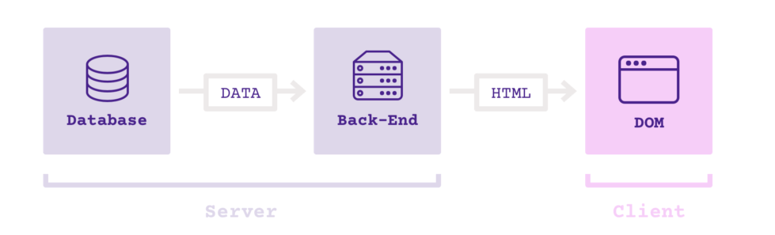
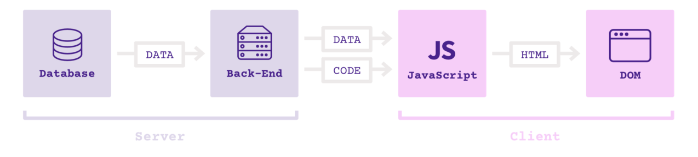
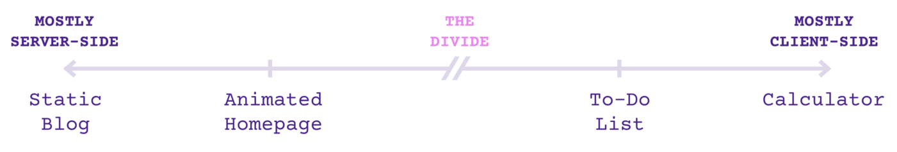
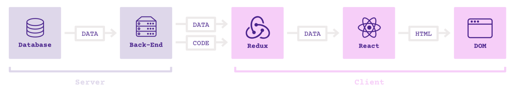

[原文链接](https://medium.freecodecamp.org/a-study-plan-to-cure-javascript-fatigue-8ad3a54f2eb1)

## JS 学习疲劳之源

Jose Aguinaga 的文章[2016 年学习 JS 的感受如何?](https://hackernoon.com/how-it-feels-to-learn-javascript-in-2016-d3a717dd577f#.5wjpn7svo)，这篇文章显然触动了很多开发者的神经，在 medium 上的阅读量超过 10K。从 2016 年以来，JS 的生态发展非常迅速，导致很多前端工程师抱怨学不动了。针对 JS 生态大爆发的现状，下面制定了一个简单上手的学习计划来帮助开发者掌握 JS 生态

## 文章目标读者

- 熟悉基本的编程概念
- 具有一些后端开发基础，比如 PHP 开发或者 Python 开发等
- 希望进入前端开发领域的读者

## 文章知识点

- 现代 JS 打造的 Web APP 展现形式
- 为什么 jQuery 不再流行
- 为什么选择 React
- 为何可以不优先学习 JS
- 如何使用 ES6
- 为什么需要 redux
- 什么是 GraphQL
- 下一步的方向

## JavaScript VS JavaScript

学习 JS 的资料非常多，可以非常深入这些 JS 技能。但是 Web 开发使用的 JS 技能不会很深，真正的难点是掌握庞大的 JS 生态。由于 JS 生态太庞杂，因此需要将精力关注于流行的核心框架上

##JS APP 的构建要素

- 传统的 JS Web 框架图如下

  

- 现代 JS APP 开发框架图如下

  

## CS 架构谱系

如果针对传统的静态站点开发，采用服务端返回 HTML 页面到浏览器渲染的方式是一种不错的体验；但是目前 Web APP 具有很多交互逻辑和数据请求操作，这种场景更适合浏览器端处理渲染。  

## JS 学习路线图

- JS 基础知识
- React 框架
- 基于 create-react-APP 这类脚手架快速搭建可用的应用
- 掌握 ES6
- 关注应用状态管理  
  
- Redux 学习，包含 Redux 生态
- 基于 GraphQL 构建 API

## 进一步学习计划

- Vue.js
- React Native
- Elm，这种函数式编程语言可以转换为 JS
- Node 及其框架
- JS 测试套件，比如 Jest/Enzyme 等
- 前端打包工具，比如 Webpack/Parcel/Rollup 等
- 前端类型系统，比如 Typescript/Flow
- JS 应用中的 CSS，比如 CSS Module/ Styled Components
- 面向桌面端的 JS 开发，比如 Electron
- 函数式编程思维，react 生态逐渐使用函数式编程范式重写
